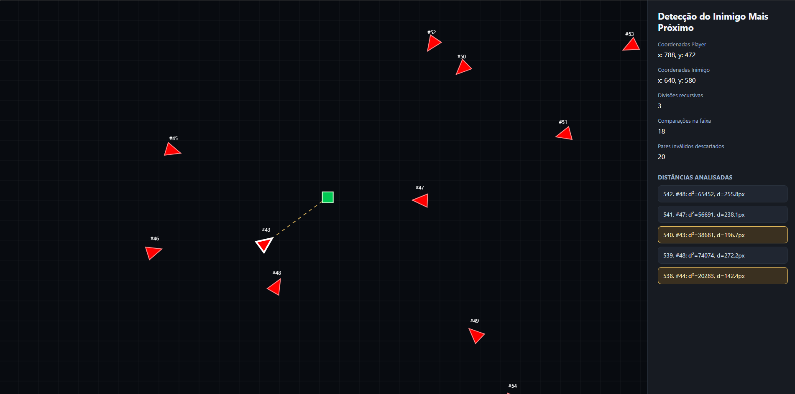
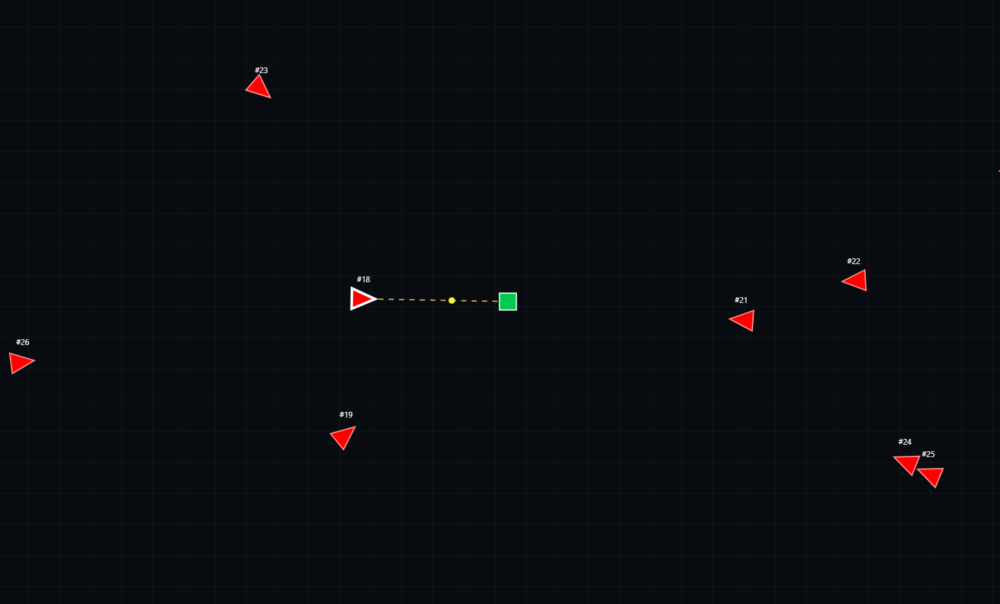
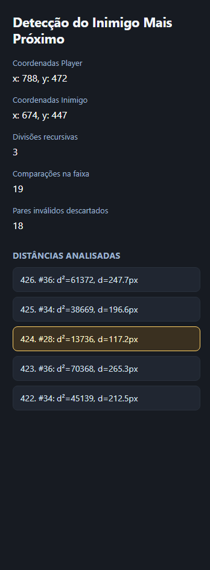

# Algoritmo Par de Pontos Adaptado em uma mecânica de jogo do gênero survivor

- Número da Lista: 8
- Conteúdo da Disciplina: Dividir e Conquistar

LINK DO VÍDEO DE APRESENTAÇÃO:

## Alunos
| Matricula | Aluno |
| -- | -- |
| 221022490 | Caua Araujo dos Santos |

## Sobre
Este projeto é um mini jogo web inspirado no gênero survivors, como Vampire Survivors e Megabonk. O objetivo principal é demonstrar, em tempo real, como a busca pelo inimigo mais próximo pode ser modelada como uma variação do problema de Par de Pontos Mais Próximos.

No problema clássico, a busca procura o menor par entre quaisquer dois pontos de um conjunto. Neste jogo, a estrutura clássica foi adaptada com uma restrição: o par só é válido quando é formado por `(jogador, inimigo)`.

## Screenshots
### Tela Geral


### Jogo Rodando


### Coluna de Resultados


## Instalação
### Pre-requisitos
- Windows ou Linux.
- Python 3.

### Como rodar o projeto
Como o projeto usa ES Modules, execute por um servidor local simples:

```bash
python -m http.server 8000
```

Depois abra:

```text
http://localhost:8000
```

Também é possível usar qualquer servidor estático equivalente.